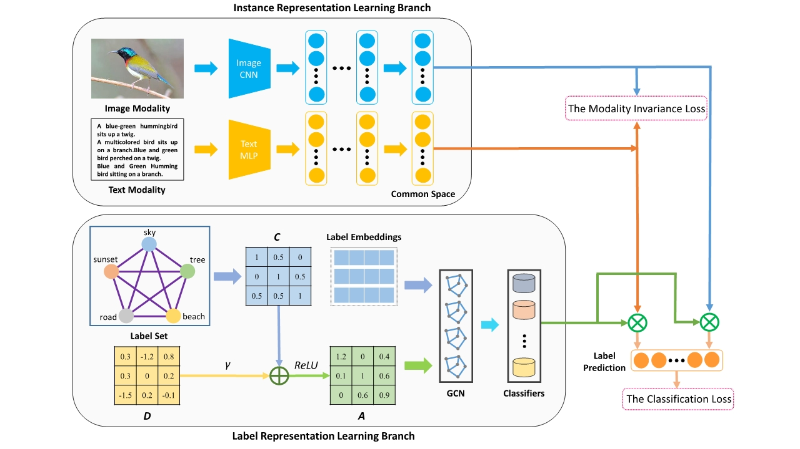
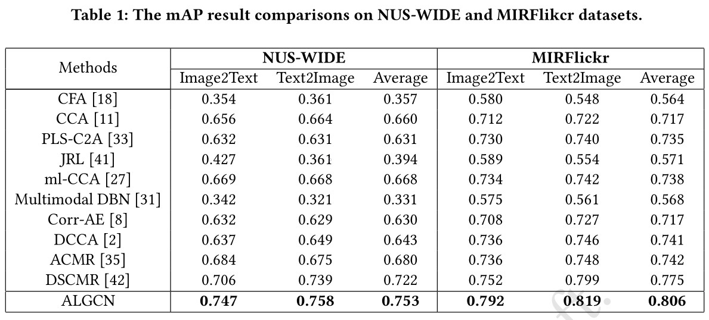
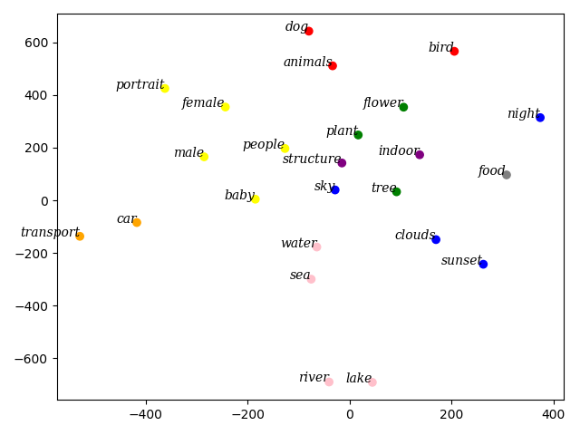
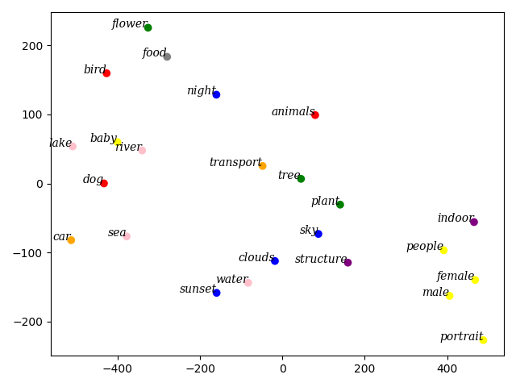

<h1 align = "center">Adaptive Label-aware Graph Convolutional Networks for Cross-Modal Retrieval</h1>

<h1 align = "center">Abstract</h1> 

Cross-modal retrieval takes the instance of one modality as the query to retrieval relevant instances of other modalities. The core of cross-modal retrieval is how to project data of different modalities into a common representation space where the content similarity between different types of data can be directly measured. However, the existing approaches typically treat  each label as an independent individual, and ignore the underlying semantic structure of labels. In this paper, we propose an end-to-end adaptive label-aware graph convolutional network (ALGCN) by designing both the instance representation learning branch and the label representation learning branch in the common representation space, which can obtain modality-invariant and discriminative representations for cross-modal retrieval. First, we construct an instance representation learning branch to transform instances of different modalities into a common representation space. Second, we adopt Graph Convolutional Network (GCN) to learn inter-dependent classifiers which are applied to obtain discriminative and modality-invariant representations for cross-modal retrieval. In addition, a novel adaptive correlation matrix is proposed to efficiently explore and preserve the semantic structure of labels in a data-driven manner. Comprehensive experimental results on two public datasets NUS-WIDE and MIRFlickr demonstrate the superiority of ALGCN, compared to the state-of-the-art  methods in cross-modal retrieval.

<h1 align = "center">Motivation</h1>

Despite that deep learning methods have shown their great success on cross-modal retrieval tasks, we have following observations: 

O1: The existing supervised methods treat each label as an independent individual in data structure level, while ignoring the label correlations of the cross-modal data.

O2: Most of existing supervised cross-modal retrieval methods merely explicitly utilize labels in the loss calculation step.

Motivated by the above observations, we propose a novel end-to-end adaptive label-aware graph convolutional network (ALGCN) to capture the label correlations for cross-modal retrieval, which can absorb information from the label graph to guide the model learning discriminative features. 

<h1 align = "center">Overview</h1>

    

<small> Figure 1. The overall structure of our ALGCN. </small>

<h1 align = "center">Experiments</h1>

## Cross-modal Retrieval

<small> Table 1. The mAP result comparisons on NUS-WIDE and MIRFlikcr datasets. </small>

    

## Visualization

To illustrate the effectiveness of the label representation learning branch, a recognized visualization tool t-SNE is utilized. Compared with the method which abandons GCN, the distribution of the learned classifiers in a same cluster is more concentrated. Meanwhile, different clusters are more separated.

    

    

<small> Figure 4. t-SNE visualization for the learned classifiers on the MIRFlickr dataset: with GCN (above) and without GCN (below). Node colors denote clusters. </small>

<h1 align = "center">Conclusion</h1>

In this paper, we propose an end-to-end Adaptive Label-aware Graph Convolutional Networks (ALGCN) to learn the common representations for cross-modal retrieval. In ALGCN, for better preserving the underlying semantic structure and bridging the modality gap, we introduce a novel joint-training framework constructed by an instance representation learning branch and a label representation learning branch, which is able to preserve the cross-modal semantic correlations among instances and mine the latent semantic structure of labels. In addition, an adaptive correlation matrix is proposed to dynamically exploit the rich semantic relations between labels in a data-driven manner, which can bring more generality to adapt to cross-modal data. Extensive experiments on two widely-used benchmark datasets have demonstrated that ALGCN can achieve superior cross-modal retrieval performance compared to state-of-the-art methods. 

